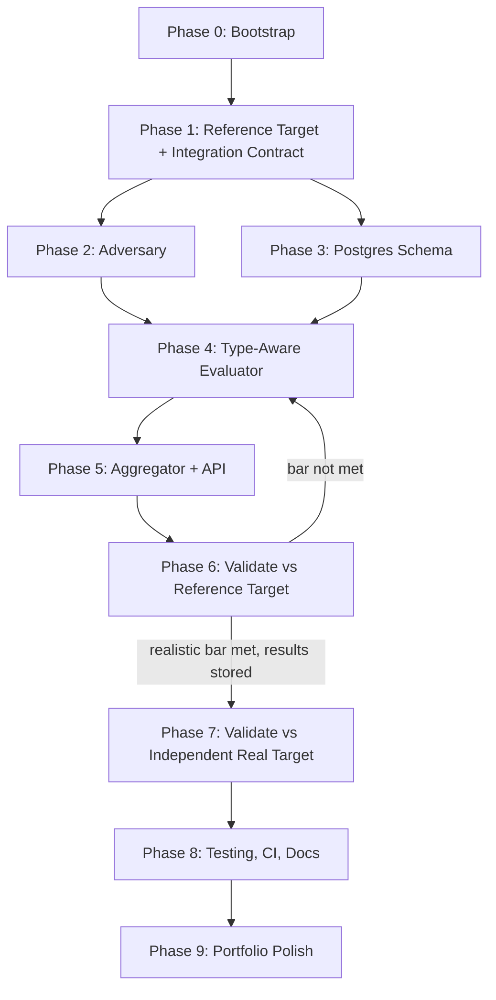

# Aegis-Eval — Agentic Implementation Specification

**Version:** 1.0
**Date:** August 24, 2026
**Audience:** An autonomous or semi-autonomous coding agent implementing this repository.
**Companion document:** `AegisEval_Architecture.md` — schemas, mechanisms, and diagrams referenced here are defined there.

---

## 0. How To Use This Document

1. Read this document and the Architecture document fully before writing code.
2. Work through phases in order. Phase N assumes Phase N-1's acceptance criteria are genuinely, numerically true.
3. Maintain `PROGRESS.md` with literal command output, not paraphrase.
4. **A phase is only PASS if its stated numeric criterion is actually met.** This project's predecessor in this line of work (LeadGuard) was repeatedly marked PASS on explicitly-failed gates, and it cost real, compounding damage down the line. Don't repeat it: a criterion that misses its threshold means the phase isn't done, regardless of how reasonable the excuse sounds.
5. If a criterion can't be met after two genuine attempts, stop and log a `BLOCKER`. Do not weaken the criterion.
6. Respect the human checkpoints in §7.

---

## 1. Mission

Build Aegis-Eval: an adversarial RAG testing harness where a small local model generates attack queries by type, and a deterministic, type-matched evaluator (never a single universal check) grades the target's responses. Validated against a purpose-built reference target and at least one independently-built real target — not a self-graded closed loop.

---

## 2. Hard Constraints — Never Violate These

- **No LLM ever renders a pass/fail verdict directly.** The Adversary generates queries. All grading is deterministic (NLI, groundedness, coverage, ambiguity-acknowledgment). If you find yourself asking an LLM "does this pass," stop — that's the exact design the source proposal's own red-team correctly killed.
- **Every `EvaluationVerdict` carries non-null `primary_evidence`.** A verdict without evidence backing it is not written to the database.
- **`bertscore` and `rouge_l` never appear in any `if` statement gating a pass/fail decision.** Logged fields only. Enforce this with an actual test (§6, Phase 4), not just a code-review habit.
- **No evaluation run starts against a target that fails the integration contract** (Architecture §6.3). Fail fast with a clear error.
- **No retuning evaluator thresholds using results from the second, independent real-target validation** (Phase 7). That pass exists to check generalization; adjusting thresholds against it defeats the purpose and should be treated as a form of p-hacking.
- **Total resident model memory (Adversary + NLI + embedding model) is measured, not assumed**, and stays comfortably under the 8GB VRAM ceiling.
- **No paid services, no paid model APIs.**

---

## 3. Environment Bootstrap

```bash
python3 -m venv .venv && source .venv/bin/activate
pip install --upgrade pip
pip install -e ".[dev]"

# LLM runtime + Adversary model
git clone https://github.com/ggerganov/llama.cpp /tmp/llama.cpp
cmake -B /tmp/llama.cpp/build -S /tmp/llama.cpp -DGGML_CUDA=ON && cmake --build /tmp/llama.cpp/build -j
huggingface-cli download Qwen/Qwen3-1.7B-GGUF Qwen3-1.7B-Q4_K_M.gguf --local-dir models/
ls -la models/*.gguf   # confirm ~1.11GB — if not, stop and investigate

# NLI + embedding models (small, CPU-or-GPU)
python -c "from sentence_transformers import CrossEncoder; CrossEncoder('cross-encoder/nli-deberta-v3-small')"

nvidia-smi
psql --version
```

**Before finalizing the Adversary model:** per the Architecture document, check whether a small (~1–2B) variant of a newer Qwen3.6/3.8-class generation exists and is a better fit than Qwen3-1.7B. Don't skip this check just because Qwen3-1.7B is confirmed to work — "works" and "is the current best small option" are different questions.

---

## 4. Global Conventions

| Area | Rule |
|---|---|
| Style | `black` + `ruff`, pre-commit enforced |
| Tests | Every evaluator mechanism gets its own hand-labeled test set (§6, Phase 4) — not just unit tests of the code path, but accuracy tests against known-correct labels |
| Config | Attack-type-to-mechanism mapping, thresholds, and model paths all in `configs/evaluator.yaml` — never hardcoded |
| Logging | Every LLM call's latency logged; every verdict's mechanism and evidence logged |
| Commits | Conventional commits, one logical change per commit |

---

## 5. Phase Dependency Map



Note the loop-back from Phase 6 to Phase 4: if the reference-target validation doesn't hit the realistic bar (Architecture §8.3), the fix is to improve the evaluator, not to lower the bar or skip ahead to the more consequential independent-target validation.

---

## 6. Phased Build Plan

### Phase 0 — Bootstrap
**Acceptance:** all imports succeed; llama.cpp smoke completion works; NLI cross-encoder loads and correctly labels one hand-written obvious-contradiction example and one hand-written obvious-entailment example.
**Self-verification:**
```bash
python -c "
from sentence_transformers import CrossEncoder
m = CrossEncoder('cross-encoder/nli-deberta-v3-small')
scores = m.predict([('The sky is blue.', 'The sky is not blue.'), ('The sky is blue.', 'The sky is blue today.')])
print(scores)  # first pair should score toward contradiction, second toward entailment
"
```

### Phase 1 — Reference Target + Integration Contract
**Tasks:** build the small reference RAG over an intentionally inconsistent/incomplete corpus (Architecture §8.1 — not Paul Graham essays or any other single-author, internally-consistent corpus, since the whole point is having real contradictions and real ambiguity to find); implement `validate_target_contract()` exactly as specified in Architecture §6.3.
**Human checkpoint:** identify and confirm the second, independent real target (Architecture §8.2) with the human now, even though it isn't used until Phase 7 — knowing what it is shapes how general Phase 4's mechanisms need to be.
**Acceptance:** reference target returns `retrieved_chunk_ids` for every query; a test confirms the contract validator correctly *rejects* a mock target that omits them (the rejection path is the one that actually matters — test it, not just the happy path).
**Self-verification:**
```bash
pytest tests/unit/test_integration_contract.py -v   # must include a test that expects a raised IntegrationError
```

### Phase 2 — Adversary
**Tasks:** wire Qwen3-1.7B via llama.cpp server; prompt generation conditioned on `attack_type` (4 types from Architecture §6.2).
**Acceptance:** generate 10 queries per attack type against the reference target's corpus (40 total); manually judge each — does a `contradiction` query actually target genuinely conflicting chunks? Does an `ambiguous` query have a real second reading? Record this human judgment in `PROGRESS.md`, since there's no automated query-quality metric yet — this phase's gate is honest human review, not a number.

### Phase 3 — Postgres Schema
**Tasks:** `AdversarialQuery`, `TargetResponse`, `EvaluationVerdict`, `EvaluationRun` tables exactly per Architecture §6.1.
**Acceptance:** schema applies cleanly; Phase 1/2 outputs load without constraint violations; recursive lookups (run → queries → responses → verdicts) return correctly.

### Phase 4 — Type-Aware Evaluator (the centerpiece)
**Tasks:** implement all four mechanisms from Architecture §6.2 — NLI contradiction, groundedness (out-of-domain), multi-chunk coverage (multi-hop), ambiguity-acknowledgment — plus the dispatcher routing by `attack_type`.
**Acceptance:** hand-construct **at least 5 labeled test cases per mechanism** (20 total, known correct pass/fail) and confirm each mechanism's accuracy on its own labeled set before trusting it on a real run. Additionally, a dedicated test confirms `bertscore`/`rouge_l` never appear in a gating conditional anywhere in `src/aegis_eval/evaluator/` (a simple static grep-based test is sufficient and appropriate here).
**Self-verification:**
```bash
pytest tests/unit/test_evaluator_mechanisms.py -v --cov=src/aegis_eval/evaluator
grep -rn "if.*bertscore\|if.*rouge" src/aegis_eval/evaluator/ && echo "FAIL: gating on informational metric" || echo "PASS: no gating on informational metrics"
```

### Phase 5 — Aggregator + API
**Tasks:** FastAPI endpoints per Architecture §10; verdict aggregation writing to Postgres.
**Acceptance:** end-to-end run against the reference target completes; `/v1/runs/{run_id}/verdicts` returns correct, evidence-populated verdicts filterable by `attack_type`.

### Phase 6 — Validate Against Reference Target
**Tasks:** run the full 40-query (or larger) evaluation suite from Phase 2 against the reference target; measure catch rate and false-positive rate per mechanism.
**Acceptance:** **contradiction mechanism specifically must land in the 85–95% catch-rate band with <10% false-positive rate** (Architecture §8.3) — this is a real numeric gate; if missed, loop back to Phase 4, don't proceed. The other three mechanisms are measured and reported with no pre-committed target, but must clear a basic sanity check: verify none of them is trivially degenerate (always-pass or always-fail regardless of input) before recording results as meaningful.
**Self-verification:**
```bash
python -m aegis_eval.evaluate --target reference --report reports/reference_validation.json
python -c "
import json
r = json.load(open('reports/reference_validation.json'))
c = r['contradiction']
assert 0.85 <= c['catch_rate'] <= 0.95, f\"catch_rate {c['catch_rate']} outside 85-95% band\"
assert c['false_positive_rate'] < 0.10, f\"FP rate {c['false_positive_rate']} too high\"
for mech in ['out_of_domain', 'multi_hop', 'ambiguous']:
    m = r[mech]
    assert 0.0 < m['catch_rate'] < 1.0, f\"{mech} catch_rate is degenerate: {m['catch_rate']}\"
print('PHASE 6 PASS')
"
```

### Phase 7 — Validate Against Independent Real Target
**Tasks:** run the same evaluation suite against the real, independently-built target confirmed in Phase 1's human checkpoint.
**Acceptance:** results recorded as-is in `reports/independent_validation.json`. **No threshold changes based on this pass** (hard constraint, §2). If catch rates collapse relative to Phase 6, that is itself the finding — write it up honestly in `PROGRESS.md` rather than treating it as a bug to quietly patch away. A large gap between reference-target and independent-target performance is real, useful information about how well the evaluator generalizes.

### Phase 8 — Testing, CI & Documentation
**Tasks:** full CI (lint + test suite); `README.md` built from only the numbers in `reports/reference_validation.json` and `reports/independent_validation.json` — no hand-typed or placeholder figures, the same failure mode already documented on LeadGuard's README.
**Acceptance:** CI green on a fresh clone; every number in the README traces to one of those two report files.

### Phase 9 — Portfolio Polish
**Tasks:** finalize README with the honest comparison between reference-target and independent-target results (a real generalization gap, reported plainly, is a stronger portfolio signal than a suspiciously perfect number); tag `v1.0.0`. Note Logic-Clash and Doc-Decay remain documented alternatives in the source proposal but are explicitly out of scope here, per that proposal's own final decision to build one project, not three.
**Acceptance:** no placeholder or invented metric remains anywhere in user-facing docs.

---

## 7. Human Checkpoints

1. **Phase 1** — confirming the second, independent real target before building around an assumption of what it is.
2. **Before Phase 7** — a light confirmation that Phase 6's numbers are genuinely in hand and stored, since Phase 7 is the harder-to-repeat validation opportunity.
3. **Any point where the Adversary's generated queries would be run against a real target the human doesn't own or control** — don't point this at third-party production systems without explicit confirmation.

---

## 8. Master Definition of Done

- [ ] All 9 phases pass with real, pasted verification output in `PROGRESS.md`.
- [ ] No LLM renders a pass/fail verdict anywhere in the codebase.
- [ ] All four evaluator mechanisms hand-validated on their own labeled test sets before being trusted on real runs.
- [ ] Contradiction mechanism hits the 85–95% catch-rate / <10% FP band on the reference target.
- [ ] Results recorded (not necessarily meeting any specific bar) against a real, independently-built target, with thresholds untouched after seeing those results.
- [ ] `bertscore`/`rouge_l` verified, by test, to never gate a decision.
- [ ] Every number in every user-facing document traces to a committed report file.

---

## 9. Failure & Escalation Protocol

1. First failure on any acceptance criterion: retry once, adjusting approach, not the criterion.
2. Second failure: stop, log a `BLOCKER` with what was tried and your best hypothesis.
3. A criterion that seems wrong is a conversation to have explicitly with the human — not something to silently redefine so a phase reads PASS.
4. Do not add a fifth attack type or a new evaluation mechanism without logging it as a scope change first.

---

## 10. Progress Log Template

```markdown
## Phase N — <name> — <date>
**Status:** PASS | BLOCKER
**Verification output:** <paste literal output>
**Notes:** <anything the human should know>
**Blocker (if any):** <what was tried, what failed, hypothesis>
```
