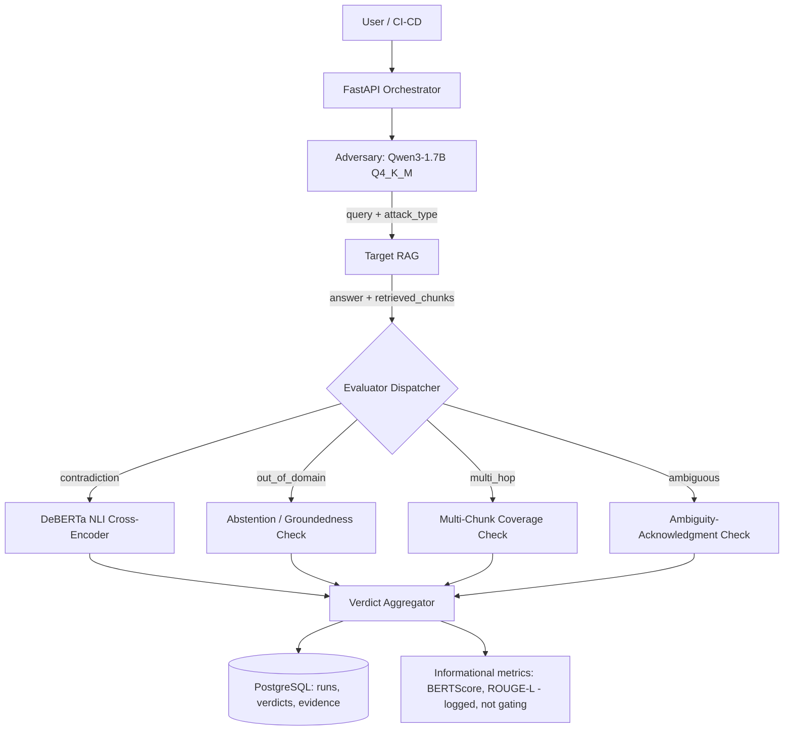

# Aegis-Eval — Adversarial RAG Evaluation Harness: Architecture Document

**Version:** 1.0
**Date:** August 24, 2026
**Status:** Approved for build
**Companion document:** `AegisEval_Agent_Implementation_Spec.md`
**Builds from:** The source proposal's final "GOD-MODE" design (single Adversary model, deterministic evaluator, no LLM Judge) — earlier sections of the source proposal describing a Llama-3-8B Judge and VRAM-swap "wow feature" are superseded and not part of this architecture.

---

## 1. Purpose & Scope

The source proposal correctly red-teamed itself out of a wasteful two-LLM design. This document takes the resulting lean design and fixes what its own red-team pass didn't catch: a single evaluation mechanism (NLI entailment) was left covering four structurally different attack types, only one of which it actually fits.

---

## 2. Analysis Summary — What Changed From the Source's Final Design

| # | Area | Gap | Resolution here |
|---|---|---|---|
| 1 | Evaluator | One NLI-vs-ground-truth check applied to all attack types | Type-aware evaluator: each attack type gets a matched pass/fail mechanism (§7) |
| 2 | Benchmark target | "Benchmark against Paul Graham essays" | Retired — contradicts the project's own "not another generic RAG demo" thesis; replaced with a purpose-built reference target (§8.1) |
| 3 | Success bar | "100% catch rate, zero false positives" | Replaced with a realistic, published-literature-consistent target range (§8.3) |
| 4 | Validation methodology | Evaluator tuned and tested only against a dummy RAG the builder also designed | Added a second validation pass against an independently-built reference RAG (§8.2) |
| 5 | Supplementary metrics | BERTScore and ROUGE-L implied as part of the pass/fail gate | Demoted to informational logging; NLI is sole gating authority for contradiction verdicts (§7.4) |
| 6 | Resource use | Freed VRAM (LLM Judge removed) left unclaimed | Reinvested into a stronger Attacker model and the added evaluator logic (§9) |
| 7 | Target integration | Implicit assumption that any "target RAG" exposes retrieved chunks | Made an explicit, checked interface precondition (§6.3) |
| 8 | Model pin | Qwen2.5-1.5B named without checking current alternatives | Qwen3-1.7B (confirmed ~1.1GB Q4_K_M) recommended instead; note that a newer Qwen3.6/3.8 generation appears to exist but only large-variant evidence was found — verify before pinning (§9) |

---

## 3. System Summary

Aegis-Eval generates adversarial queries against a target RAG system, classifies each query by attack type at generation time, and routes each resulting response through the evaluation mechanism that actually matches that attack type — never a single universal check. Every verdict is logged with its supporting evidence; every run is reproducible from a stored seed and query set.

---

## 4. Design Principles & Hard Constraints

| Principle | Implication |
|---|---|
| Deterministic evaluation is the default | LLM involvement is confined to query *generation* (the Attacker). No LLM ever renders a pass/fail verdict directly. |
| One attack type, one matched mechanism | The evaluator is not one function — it is a dispatcher over four mechanisms (§7). |
| No self-graded validation | The evaluator must be checked against at least one target the builder did not design to be caught (§8.2). |
| Hardware-honest | 8GB VRAM ceiling; current design uses well under half of it, deliberately, with the remainder allocated in §9, not left idle by default. |
| $0 infrastructure | Local-only. No paid model APIs. |

---

## 5. High-Level Architecture



### 5.1 Component Specifications

| Component | Responsibility | Tech |
|---|---|---|
| Adversary | Generates a query for a specified attack type, given retrieved context from the target's index | Qwen3-1.7B Q4_K_M |
| Target RAG | The system under test — either the purpose-built reference target (§8.1) or a real external system meeting the integration contract (§6.3) | External / reference implementation |
| Evaluator Dispatcher | Routes each (query, attack_type, response) triple to its matched mechanism | Deterministic Python, no LLM |
| NLI Cross-Encoder | Entailment/contradiction check for `contradiction`-type attacks | DeBERTa-v3-small (NLI-tuned) |
| Groundedness Check | For `out_of_domain` attacks: verifies every factual claim in the answer traces to a retrieved chunk above a similarity threshold; if the answer confidently asserts anything ungrounded, fail; if it abstains, pass | Deterministic — reuses the claim/evidence-linking pattern from evidence-backed reporting design |
| Multi-Chunk Coverage Check | For `multi_hop` attacks: verifies the answer's supporting evidence spans ≥2 distinct retrieved chunks, not one | Deterministic, checks citation/source spread |
| Ambiguity-Acknowledgment Check | For `ambiguous` attacks: verifies the answer either asks a clarifying question or explicitly surfaces multiple interpretations, rather than confidently committing to one | Small deterministic classifier or rule-based pattern match — not the main NLI model |
| Verdict Aggregator | Combines the matched mechanism's verdict with logged (non-gating) BERTScore/ROUGE-L, writes to Postgres | Deterministic |
| PostgreSQL | Canonical store: runs, queries, responses, verdicts, evidence | |

---

## 6. Data Architecture

### 6.1 Canonical Entities

**`AdversarialQuery`**

| Field | Type | Notes |
|---|---|---|
| `query_id` | string | |
| `run_id` | string | FK |
| `attack_type` | enum: `contradiction / out_of_domain / multi_hop / ambiguous` | Set at generation time — this is what routes evaluation |
| `query_text` | string | |
| `source_chunk_ids` | list[string] | Chunks the Adversary drew on to construct the query |
| `generated_at` | timestamp | |

**`TargetResponse`**

| Field | Type | Notes |
|---|---|---|
| `response_id` | string | FK to `AdversarialQuery` |
| `answer_text` | string | |
| `retrieved_chunk_ids` | list[string], **required, non-empty** | If the target can't supply this, it fails the integration contract (§6.3) before evaluation even starts |

**`EvaluationVerdict`**

| Field | Type | Notes |
|---|---|---|
| `verdict_id` | string | |
| `response_id` | string | FK |
| `mechanism_used` | enum: matches `attack_type` | Records which of the 4 mechanisms actually ran |
| `pass_fail` | bool | The gating verdict |
| `primary_evidence` | string | e.g. NLI label + confidence, or list of chunk IDs used for coverage/groundedness |
| `bertscore` | float, informational only | Never gates |
| `rouge_l` | float, informational only | Never gates |

### 6.2 Attack Type → Mechanism Table (the centerpiece fix)

| Attack type | What "correct RAG behavior" means | Matched mechanism | Fails if |
|---|---|---|---|
| `contradiction` | Answer must not assert something the source contradicts | NLI entailment/contradiction vs. retrieved chunks | NLI returns `contradiction` with confidence above threshold |
| `out_of_domain` | Answer must abstain or hedge, not confidently invent | Groundedness check: every claim traces to a retrieved chunk above similarity threshold | Answer makes an ungrounded confident assertion |
| `multi_hop` | Answer must synthesize ≥2 chunks, not answer from one in isolation | Multi-chunk coverage check | Supporting evidence comes from only one chunk when the query requires synthesis |
| `ambiguous` | Answer must surface the ambiguity, not silently pick one reading | Ambiguity-acknowledgment check | Answer commits to a single interpretation without acknowledging the alternative |

### 6.3 Target RAG Integration Contract

Any target system evaluated by Aegis-Eval **must** return, per query: the answer text, and the specific retrieved chunks it used to generate that answer. This is checked at integration time, before any evaluation run starts:

```python
def validate_target_contract(response: dict) -> None:
    if not response.get("retrieved_chunk_ids"):
        raise IntegrationError(
            "Target RAG did not return retrieved_chunk_ids. "
            "Aegis-Eval cannot evaluate a black-box system with no retrieval evidence."
        )
```

Black-box systems that return only final answers are explicitly out of scope until they expose this.

---

## 7. Model Stack

| Role | Model | Size | Notes |
|---|---|---|---|
| Adversary | Qwen3-1.7B, Q4_K_M GGUF | ~1.11GB (confirmed) | Replaces the source's Qwen2.5-1.5B — same footprint class, newer generation |
| NLI Cross-Encoder | DeBERTa-v3-small, NLI-tuned | <500MB | Sole gating authority for `contradiction` verdicts |
| Groundedness/Coverage/Ambiguity checks | Small embedding model + rule-based logic | <500MB | No new LLM — reuses the same embedding model already needed for retrieval |
| **Total VRAM** | | **~2.5–3.5GB of 8GB available** | Deliberate headroom (§9), not incidental slack |

**Before pinning the final model:** a Qwen3.6 or Qwen3.8 generation appears to have been released recently; only evidence for large (27B-class) variants was found during this review. Verify whether a small (~1–2B) variant of that generation exists and outperforms Qwen3-1.7B before finalizing — don't assume it does or doesn't.

---

## 8. Validation Methodology

### 8.1 Reference Target (replaces "Paul Graham essays")

Build a small, purpose-specific reference RAG over a corpus chosen to actually exercise all four attack types — e.g., a set of internally-inconsistent or intentionally-incomplete technical documents (not a single coherent author's essays, which by construction rarely self-contradict or have real ambiguity to surface). This reference target is Aegis-Eval's own project artifact, built specifically to have known, documentable weak points.

### 8.2 Second, Independent Validation Pass (closes the self-graded-homework gap)

After validating against the reference target in §8.1, run Aegis-Eval against **at least one real, independently-built open-source RAG reference implementation** that the builder did not design. Do not tune the evaluator's thresholds using results from this second pass — it exists to check generalization, and re-tuning against it defeats that purpose.

### 8.3 Realistic Success Criteria (replaces "100%, zero false positives")

| Metric | Target | Rationale |
|---|---|---|
| Contradiction catch rate (NLI-gated) | 85–95% | Consistent with published NLI cross-encoder performance on adversarial sets — not 100% |
| False positive rate | <10% | A nonzero, stated tolerance, not an implied zero |
| Out-of-domain / groundedness catch rate | Measured and reported, no pre-committed target | This mechanism is newly designed here — establish a baseline before setting a bar |
| Multi-hop / ambiguity catch rate | Measured and reported, no pre-committed target | Same reasoning |

---

## 9. Resource Reinvestment

Removing the LLM Judge freed roughly 4.5GB of VRAM headroom relative to the source's original two-LLM design. This is deliberately spent on:
1. A capable-but-still-small Adversary (Qwen3-1.7B rather than the smallest available model), producing better-quality adversarial queries.
2. The four-mechanism evaluator (§6.2) instead of one, which needs a small embedding model resident alongside the NLI cross-encoder — previously would have competed with a much larger LLM Judge for the same memory.

---

## 10. API Design

| Method | Path | Purpose |
|---|---|---|
| `POST` | `/v1/runs` | Start an evaluation run against a target (reference or externally registered) |
| `GET` | `/v1/runs/{run_id}/verdicts` | Retrieve verdicts, filterable by `attack_type` |
| `POST` | `/v1/targets/register` | Register a target RAG endpoint; validates the integration contract (§6.3) immediately |
| `GET` | `/v1/health` | |
| `GET` | `/v1/metrics` | Aggregate catch rates, false-positive rates, by attack type |

---

## 11. Non-Functional Requirements

| Category | Requirement |
|---|---|
| Performance | Full run of 100 adversarial queries completes without requiring more than one model resident at a time |
| Reliability | Registering a target that fails the integration contract (§6.3) fails fast with a clear error, not a silent empty evaluation |
| Reproducibility | Every run stores its random seed and full query set — a run can be replayed exactly |
| Security | Local-only API; target systems are assumed untrusted and sandboxed — the Adversary's generated queries are never executed as code or shell commands against the target |

---

## 12. Repository Structure

```
aegis-eval/
├── README.md
├── pyproject.toml
├── configs/{evaluator.yaml, models.yaml}
├── src/aegis_eval/
│   ├── adversary/          generate_query.py (attack_type-conditioned)
│   ├── targets/            reference_target.py, integration_contract.py
│   ├── evaluator/          nli_contradiction.py, groundedness.py, coverage.py, ambiguity.py, dispatcher.py
│   ├── metrics/            bertscore.py, rouge.py  (informational only — enforced via module docstring + tests)
│   └── data/                schema.py (Postgres models)
├── api/main.py
├── tests/
└── docs/{architecture.md, validation_methodology.md}
```

---

## 13. Risk Register

| Risk | Likelihood | Impact | Mitigation |
|---|---|---|---|
| Groundedness/coverage/ambiguity checks (newly designed here) turn out unreliable in practice | Medium | High | No pre-committed success target for these (§8.3) — measure honestly before claiming a number |
| Second independent validation target is hard to find or integrate | Medium | Medium | Integration contract (§6.3) is the filter — pick any real RAG implementation that already exposes retrieved chunks |
| BERTScore/ROUGE-L get silently used as gates anyway by future contributors | Low–Medium | Medium | Enforce via a test asserting these fields never appear in any pass/fail code path |
| Reference target (§8.1) ends up too easy, understating real-world failure rates | Medium | Medium | The independent second target (§8.2) is what actually catches this |

---

## 14. Glossary

- **NLI (Natural Language Inference)** — Classifying a (premise, hypothesis) pair as entailment, contradiction, or neutral.
- **Groundedness** — Whether every claim in a generated answer traces back to retrieved source material.
- **Self-graded validation** — The failure pattern where a system's evaluator is validated only against test cases the same builder designed, proving little about generalization.

---

## 15. Change Log

| Version | Date | Change |
|---|---|---|
| 1.0 | 2026-08-24 | Initial architecture from the source's final God-Mode design; added type-aware evaluator, retired Paul Graham benchmark, recalibrated success criteria, updated model pin |
